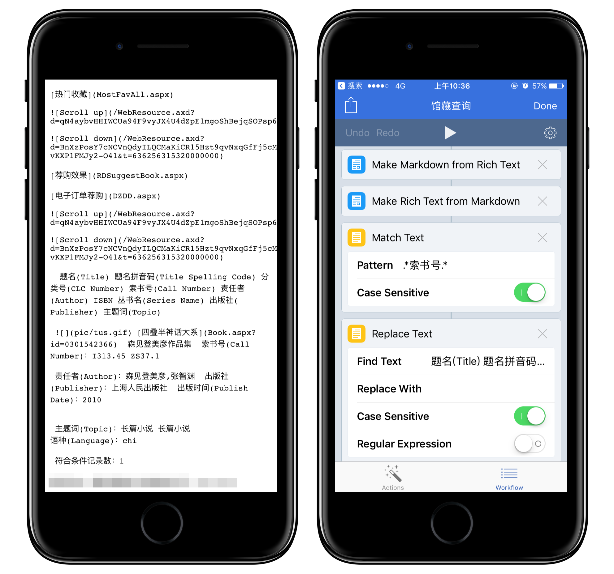

想必一场突如其来的旅行中，最糟糕的就是刚刚在外卖推荐里找到车次信息，火车已经从身边驶过。我们查快递的时候，购物网站的广告夺人眼球；即使是鲜有广告的学术网站，其老旧诡异的界面与交互也实在是令人难受。每次打开学校图书馆网页查馆藏，我都觉得自己在做一件愚蠢的事。我被淹没在信息垃圾里了。

我花一个早晨写了这个查询图书馆馆藏的 workflow，终于不用在一桌饲养场里小猪一样的自习者身边停下，忍受他们嗷嗷待哺的目光了：

<center></center>

这个 workflow 的需求很简单：

* 返回书名和索书号
* 结果简明不含垃圾信息
* 不离开通知中心、不打开 workflow 软件

分析了搜索结果网页的 URL 后我惊喜地发现，关键词就包含在里面：

```
http://......&SecSerchWord=&Titlie=四叠半&.......
```

于是我写了这么一部分 workflow：

<center></center>

但是我校返还的JSON是这样的：

<center></center>

我是一个主动编码的优秀业余程序爱好者，但是这个网页的制作者太不负责了。我得从别的格式入手，于是我把它们解析成了富文本格式，可以得到一堆能编辑的文字。在这里，由于不能直接解析网页了，所以要用正则表达式匹配我需要内容：索书号。[.*索书号.*]的意思是匹配有「索书号」的那一整行。在我的另外一个 workflow 里，还涉及跨行匹配，那就另当别论了。

<center></center>

先解析成 Markdown 是为了从网页转换过来，转换成富文本则是要摈弃 Markdown 的一些格式语法，以免出现这样的情况：

<center></center>

最后，通过 ~~List~~ Alter 的方式直接在 Widget 显示

至此这个 workflow 已经完成了，听下来非常容易对不对？一点也不。我很喜欢这个 workflow，它基本做到了效率和优雅。如你所见，workflow 要处理的是工作流，在我需要查书的时候，点一下、等两秒就可以得到结果，然后我就去找那本书了。我没有时间去一一打开网页，没有心思浏览亚马逊本季推荐，我做我该做的。

****

显示方式的参考：
- [Workflow + 快递 100 原来快递既能这么查，还能这么显示](https://sspai.com/post/36865)
- [Workflow+快递100，原来快递还能这么查](https://sspai.com/post/35383)

解析网页的参考：
- [Workflow 教程（八）：利用新的请求方法打造 Web 小程序](https://sspai.com/post/35857)
- [Workflow 教程（七）：征服 Workflow 中的最高峰](https://sspai.com/post/30870)