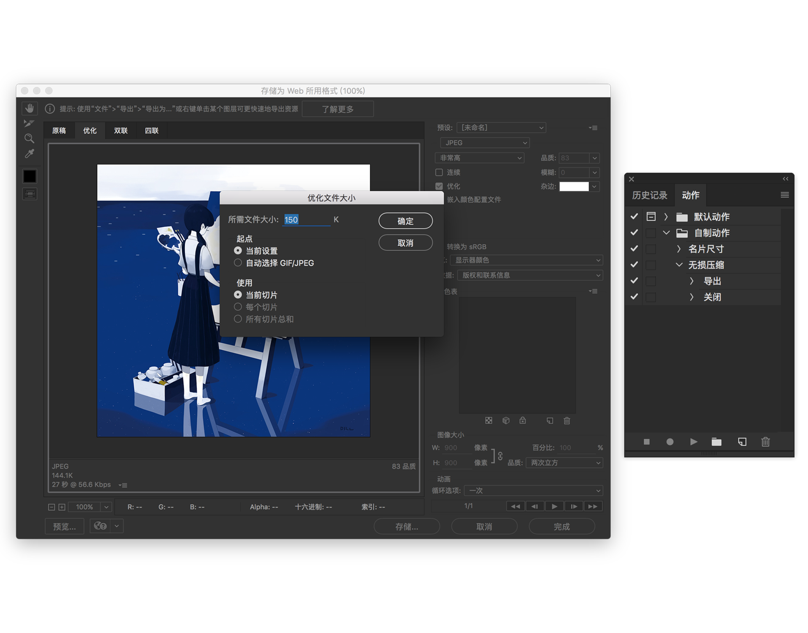
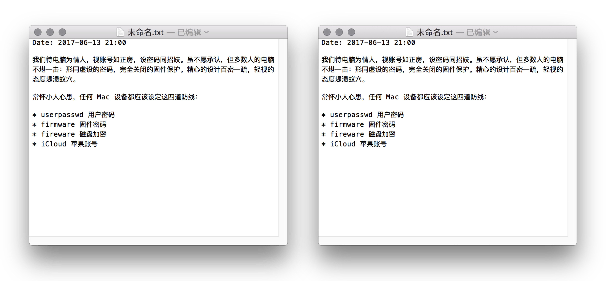

无损，最好自动。此前使用 ImageAlpha，试用 JPEGmini Pro，效果脱俗。前者手动单张转换，后者近千售价，作罢，遂 Ps 建一批处理。

思路为网页格式自动优化，录制简单，注意动作「关闭」中选择「不保存修改」，可一键转换，无需中途确认。丢一千张 RAW 进去最舒服不过。

使用 Ps 在于本功能不必额外付费，且可自动化处理。效果如何？拔群。可见对比（左 Ps，右专门软件）：

可见，Ps 压缩质量和专门软件相差无几，甚有优势，且可客制。

| |ps|imagealpha|jpegmini pro|
| ------------- |:-------------:| -----:| -----:|
||ps|imagealpha|jpegmini pro|
|图片格式|所有格式|png|jpeg|
|压缩率|客制|40%|40%|
|自动化|批处理|手动|批处理|
|保留原图|保留原图|保留原图|不保留|
|价格|年订阅|免费|$99|