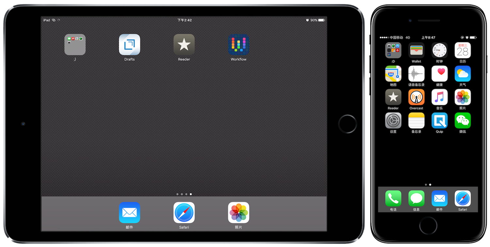
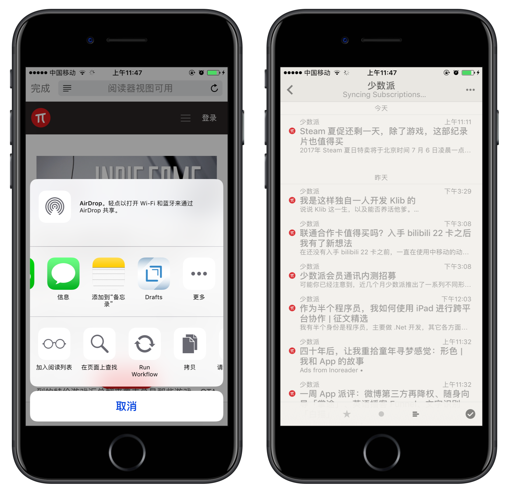
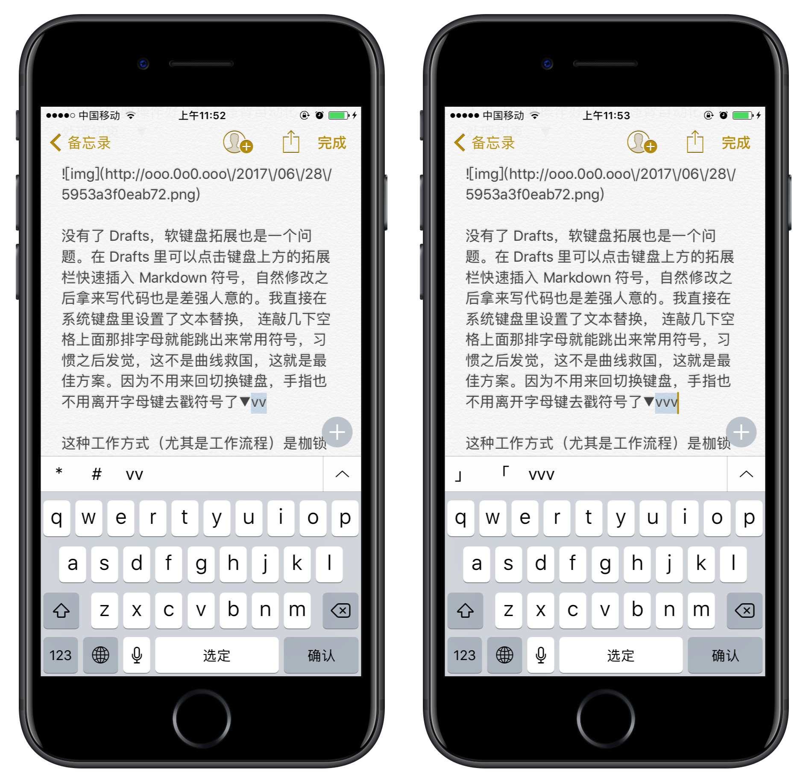

我是半个「数字游民」，远程工作、时间自由、享受旅行。虽然经过精简，iPad 已经被 iPhone 代替，曾经拥有过的 iPad mini4 仍然是我最喜爱的数码产品，它像一本 Moleskine 笔记本，随时帮助我思考和记录。

## 得天独厚的硬件

轻巧的 mini4 很适合单手握持，不突起的摄像头允许设备平放在桌上，配合 smart case 可以达到适合观影／输入的角度。我不喜欢分屏，小屏幕的 iPad 带来更多便携优势，尺寸限制反而促使我建立线性的工作流。

iPhone6S 可以用 3D-touch 移动光标，iPad 则可以两指移动实现。这让在 iOS 设备上的文字输入变得爽快，因为手指不再需要离开键盘区域，去拥挤的文本框里搓来搓去。如果你不能理解，请想象一下在 MacBook 上打字，学习一些光标快捷键（大多是 vi 系或 emacs 系）会让手指留在键盘上，无需频繁辗转于触控板和键盘之间。全键盘党称之为效率，而在触控作为唯一的输入方式的 iPad 上，不用频繁大范围移动手指就是相似的「效率」。

## 一气呵成的工作流

我的 iPad 只安装了两三个应用，每天都要用到的只有 Reeder、workflow 和 Drafts。阅读-摘录-整理-写作，就是我一遍遍在干的事▼

我在 Reeder 里订阅了大量站点，经过 inoreader 过滤后推送过来，就像订牛奶一样惬意。Reeder 更新后支持了 Safari View Controller，这意味着我看到好文章可以「run workflow」保存，甚至直接用 「Drafts 摘录模版」做个剪报▼

浏览订阅的时间固定在起床后和中午，前者还饿着，后者没吃够，都是思维不至于太浑噩的时间，适合有感而发。打开 Drafts 开始写作，这个能跑 javascript 的文字编辑器任君改造，我拿的出手的不过是简单的正则表达式批量替换文本，其他 Extension 都很基础▼

作为写作应用，Drafts 的唯一缺陷就是不能和 Mac 无缝同步，毕竟没有 macOS 客户端。在把许多插件功能转移到 workflow 之后，我就卸载了它，用备忘录来写作。我的 workflow 很多，绝大部分作为 Extension 使用，常用的批量带壳截图、摘录模版、插入图链／链接，基本自制，别人设计的要操作好几步，违背自动化／批处理初衷。▼

没有了 Drafts，软键盘拓展也是一个问题。在 Drafts 里可以点击键盘上方的拓展栏快速插入 Markdown 符号，自然修改之后拿来写代码也是差强人意的。我直接在系统键盘里设置了文本替换， 连敲几下空格上面那排字母就能跳出来常用符号，习惯之后发觉，这不是曲线救国，这就是最佳方案。因为不用来回切换键盘，手指也不用离开字母键去戳符号了▼

这种工作方式（尤其是工作流程）是枷锁之舞，也是自我克制。在 Mac 上我很难集中精力，忍不住要多开几个桌面，多加载一排 tab，但在 iPad 上这都做不到，我不得不把精力集中在每一步。我从和 iPad 的磨合中认识到许多美好的东西：批处理，自动化，工作流……在 iPad 的大块触屏上，可视化编程的 workflow、跑 javascript 的 Drafts，。Automator 也好，Office 的宏也罢，都没有做到 workflow 的高度：自动化普及领域的 iPhone4。这份荣耀就不是 iPad 独享的了，虽然岁月静好，践行极简主义之后，我还是惜别 iPad，把工作流转移到了 iPhone 上。

## 给 iPad 的一点祝福

上周， 我写道，

> 几年前，我说，我在 iPad 上写博客，别人的反应是：「iPad 不是游戏机吗？」
> 以后，我说，我忘带电脑了，也许甲方就会一脸猥琐：「iPad/iPhone 不也能做吗？」
> 所以我把 iPad 「丢」了，兜里揣台电话，背包偷藏电脑。

我还是觉得，iPad 越发具有「生产力」，给我带来了压力。这种压力是基于它「日后在部分领域比肩笔记本电脑甚至台式机」这一预期的，想到几乎人手的一只的平板电脑甚至智能手机，都会变成「生产力工具」，兴奋之余不免担忧，自由的时间或许会被机器支配，而这一波动肯定比笔电来得猛烈。

前不久的 WWDC 为 iPad 带来翻天覆地的变化，在越发完善的系统和日益默契的配件之加持下，iPad 正在变得越来越好用。我曾经把它作为优秀的「便携打字机」，如今只是出于乖张的原因不再使用罢了，但它日益精进，正在很多领域持续发力，成为部分细分市场的主流「生产力工具」也未尝不可。

***

参考链接

- [iPad 是通向「数字游民」生活的钥匙吗](https://blackwinmin.github.io/posts/iPad-是通向-数字游民-生活的钥匙吗/)
- [不再用 Markdown Editor](https://blackwinmin.github.io/posts/不再用-Markdown-Editor/)
- [什么是数字游民生活方式？](http://jarodise.com/definition/)