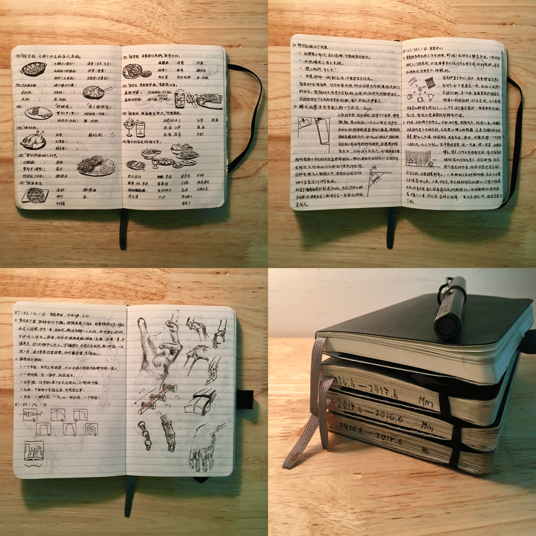
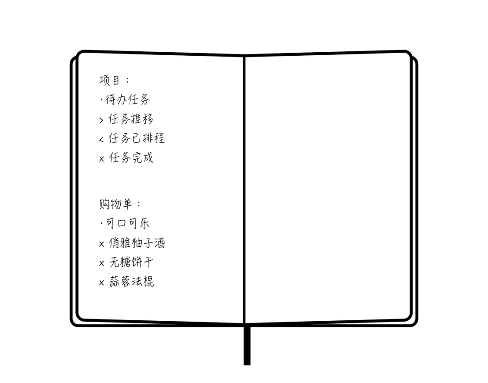
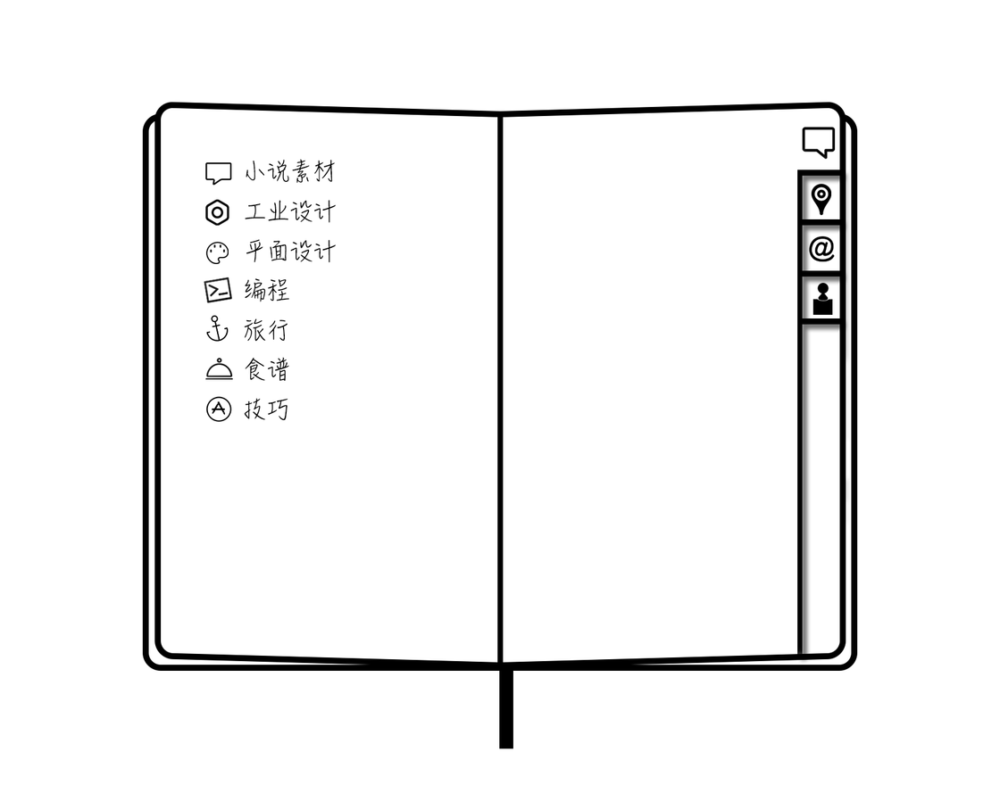
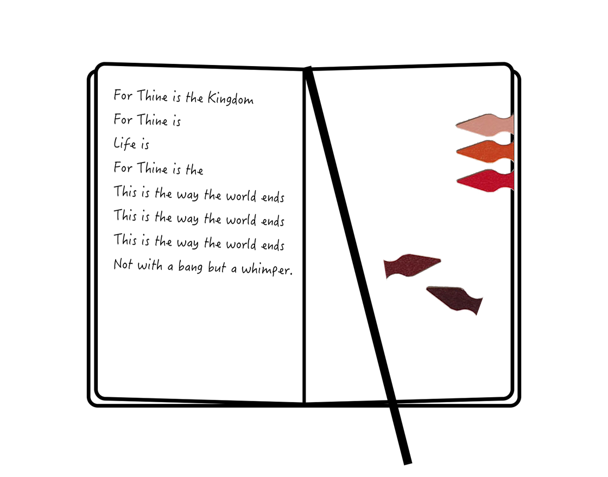
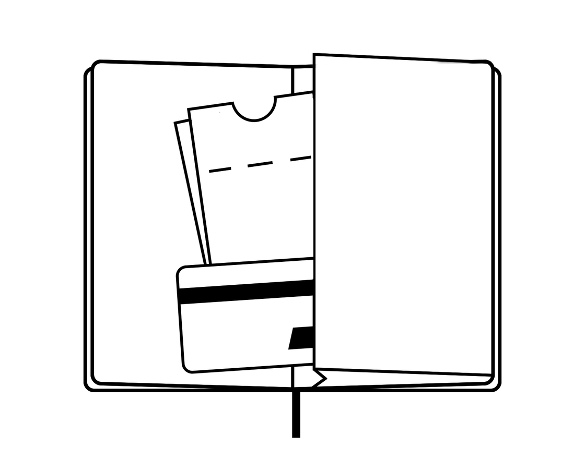
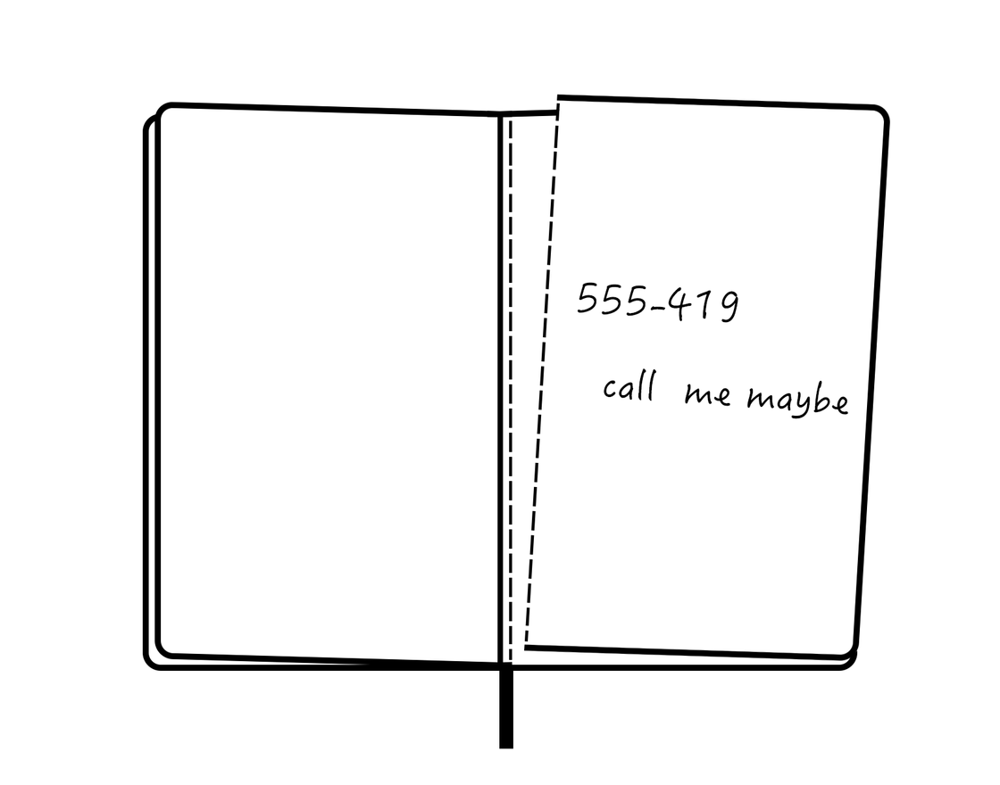

好用的软件那么多，我却坚持做纸笔手帐。

## 我的手帐

小子日常携带一本 B6 绑带软面抄，搭配一根自己打磨过的钢笔。这本手帐是 GTD，是日记，也是素描本，非常宽松灵活▼

我将每次书写视为一次信息处理，输入、处理到输出，像程序一样清晰，而非流水账。我尝试将数字思维带到纸笔记录，提高效率，增加乐趣。

今年已是做手账的第四个年头，从 Doodle 到借笔建模，从吸取 Markdown、Task paper 到采用 BUJO，逐渐有了自己的风格和系统。

## 输入：素材收集

有人认为，素材多多益善，无论是课堂笔记，抑或写作素材，只恨难以等身高。惜我精力有限，未能消化得了，就一直记得精简。小子基本只收集三类素材：问题、方法和「原始资料」：

- 收集问题：问题转化为需求，推动行动
- 收集方法：参考别人的解决方案，实践它，变成自己的
- 收集原始资料：包括访谈记录、采风速写、风光拍立得等

每一次记录都不多，只百字上下，下笔前深思熟虑，记录后不断回溯。

## 处理：系统管理

手帐不比软件，不可复制，亦难检索。系统管理，确有必要。

### 搞定：GTD

当一件事复杂到需要记在纸上时，我习惯把它拆分成几个很快能完成的条目，逐个攻破。我理解的 GTD，是拆分与取舍的艺术。

我借鉴了 Task paper 和 BUJO（子弹笔记）的符号，进行任务管理。Task paper 很适合中小项目，比如一次购物，一次聚会准备。当然在纸上不能敲「Tab」来缩紧，BUJO 的符号就很有用了。任务不同阶段的符号是可以重叠的，画在纸上可以减少涂改，使项目整洁直观▼

也许哪日 Scanner Pro 更新，扫一扫把手帐转 Markdown 也未尝不可（笑

### 检索：标签管理

即然不能在手帐里按下「cmd + F」，只好做足标签管理的工作。

我曾经用 @ 和 # 来做 Tag，不幸在纸上很不直观。目前我采用简单的符号表示这段话大概讲哪方面内容。小子涉猎很泛，概括起来有平面设计、工业设计、项目管理、小说素材、编程、旅行、食谱、和 life hacking，画着标签，找起笔记来也方便。而一些经常参考的内容，如地址、计量衡，我会做一列类似电话簿上的标签（右）▼

此外，使用书签也是方便检索的途径。某段文字，灵感乍现、日后翻阅也有一番风味，就别上 bookdarts 书签；上次停笔的那页，夹着丝带书签，一拉就翻到继续下笔的地方▼

手帐的内容，基本是一番思考、提炼后写下的，自己记得很牢，回过头来找一些东西，没有想象的那么困难，就不羡慕电脑上字符级的精确检索了。

### 稍后读：归档整理

Star 的文章，分享的链接，不假思索丢进稍后读列表，的确爽快。但是有多少人会去 review it 呢？任务清单只消一笔划掉，而手帐里夹带的纸质资料仍需妥善整理与保存。我的手帐封底上附有油布口袋，讲义剪贴、导游图、优惠券乃至拍立得照片都细心保存于此，谓之「Inbox 文件夹」▼

这个文件夹里的纸质资料务必定期清理，扫描进 Apple Wallet、即时用掉，清除不必再保留的资料，保持「常空」。

### 协作：易撕便笺

如果撕下一张纸，写个便条给别人，对称的那页也会掉落。我预先在距离缝线 1～2 毫米处，划一道邮票齿孔般的槽，就能利落地撕开。这样的处理不用多，手帐最后几页专门留作便笺就足够。

这就是我的「分享菜单」，我乐于撕下一页纸，把想法和别人共享▼

下次给被人留电话号码，就不担心唰——的扯下半本本子了。

## 输出：应用

手帐相对私密、封闭，「输出」无需把内容扫描成 PDF 以分发传道，而是加以运用。任务清单可以回头看，粗略统计自己的效率曲线。很多素材，我也用在了写作上，架空小说更新在人迹罕至的公众号，偏技术的文章则在博客里发酵。最实用的是那些 Life-hacking 的技巧，我会反复练习，烹制「迷宫饭」里的「黑暗料理」，缝制布基胶带钱包。某种程度上，我的手帐就像《怪诞小镇》里神奇的的六指日记。

厚厚实实的手帐也好，不占物理空间的云笔记也罢，其价值总不在于压箱底或垫桌脚嘛。

## 结语

务必阐明，记手帐是为了帮助思考，绝非挖空心思制作工艺品。一般我只用一支钢笔、一本本子，黑白两色，有所节制，追求简洁。

手机电脑能完成得更好的，就不劳纸笔。运动、睡眠的曲线，日历提醒，交给电子设备更加方便，手帐专注的，不过梳理。

用数字思维做手帐，能把事情厘得更清，做得更好。

------

参考链接：

- [子弹笔记 —— 你所需要仅仅是笔和本](https://sspai.com/post/39340)
- [TaskPaper – Plain text to-do lists for Mac](https://www.taskpaper.com)