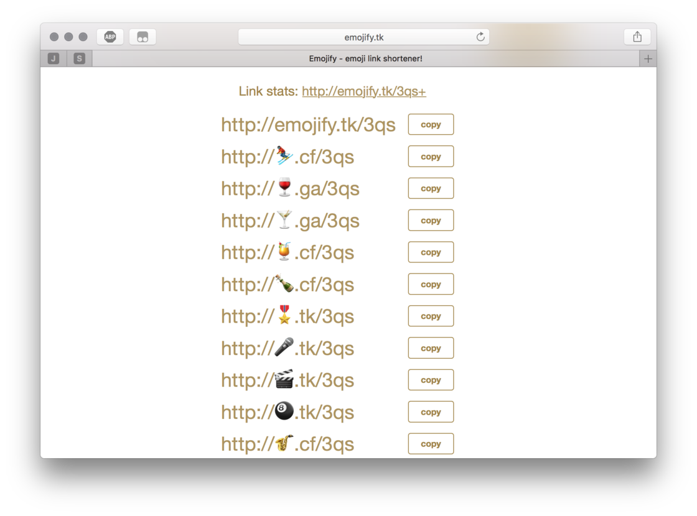

冗长的纯文字链接让人感到乏味，不如做个带 emoji 的短链接▼

http://🎖.tk/3qA

http://🥇.tk/3qA

http://🥈.tk/3qA

如何制作？
这种短链用到了 Emojify 的服务，它只有一个简单的 web 页面，可以把网址转为带有 emoji 表情的短链接▼

生成的网址是可以在浏览器里打开的。需要注意的是 ，这个链接不能被微信直接识别打开，小子建议仅仅拿它来为文字增色。

***

链接：[Emojify🤣](http://emojify.tk)