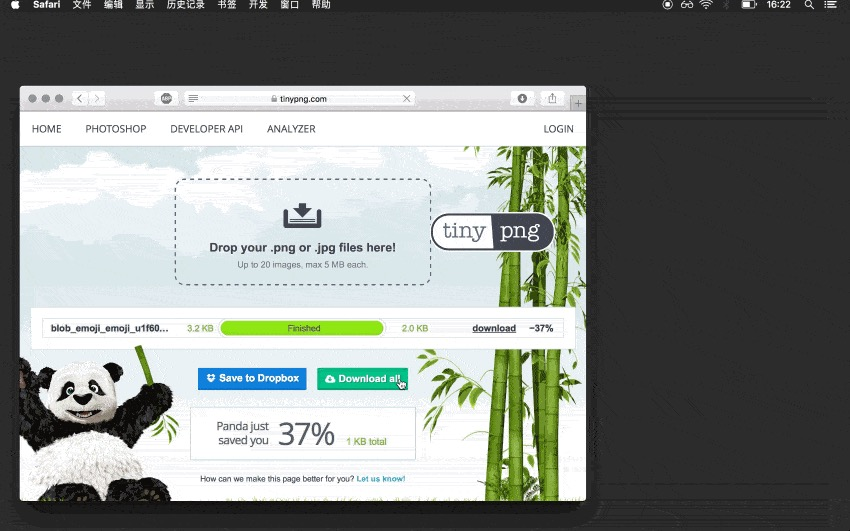
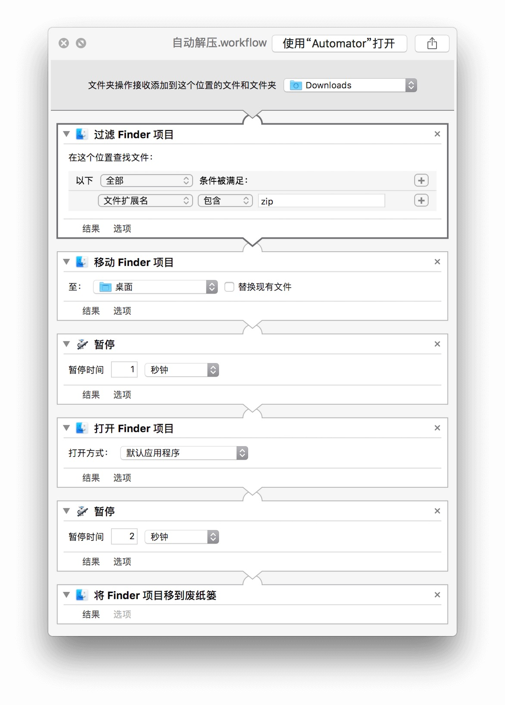
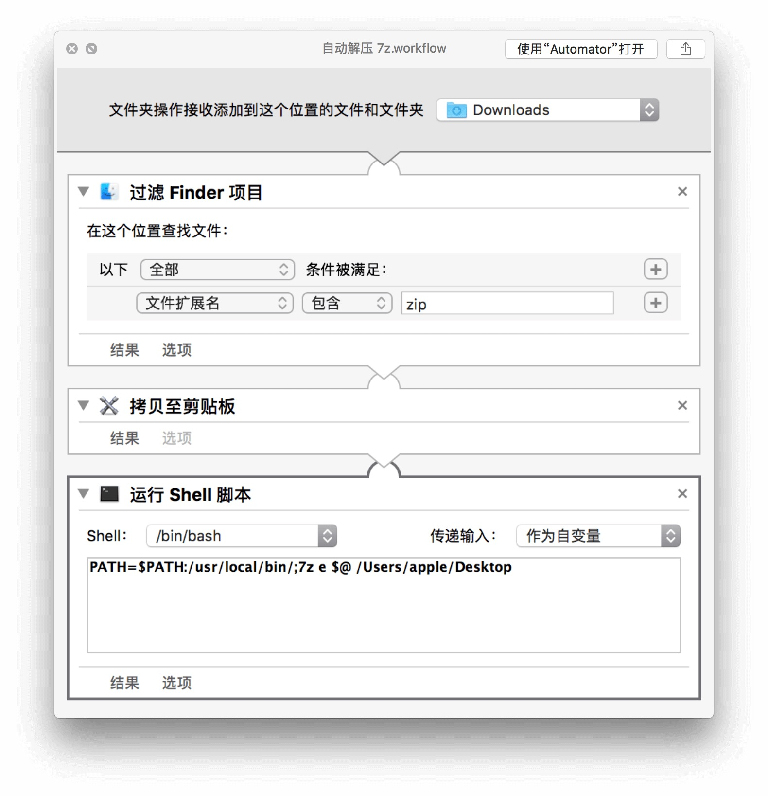
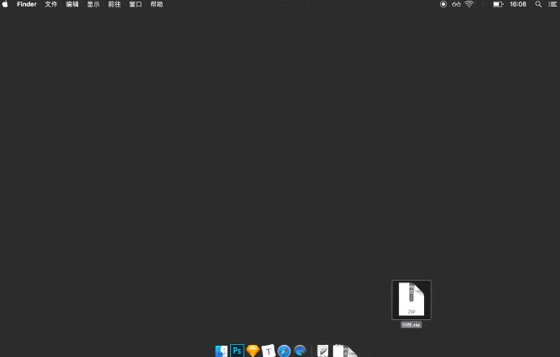
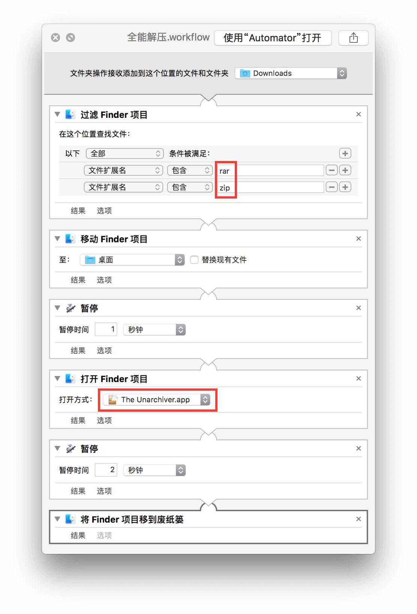

近来文章配图增加，多次往返于 TinyPNG 与下载文件夹之间，手动解压、拖移处理后的图片，极为低效。无奈压缩包的下载断断续续，随需而下，并非一次搞定，难以依靠批处理实现解压。

恰巧正值无新闻可看之际，翻出陈年播客来听，@ibuick 提及 Automator Folder Action（文件夹动作），以文件变动触发预定动作。即拍手叫好，开盖制作。

**效果：检测到下载文件夹有压缩包，自动解压至桌面，随后删掉压缩包文件**：



## 解压 zip 文件

Folder Action 可以检测制定文件夹内的文件变化，然后做出一些动作。于是可以在 Automator 中创建一个 Folder Action，左「文件夹接受添加到这个位置的文件和文件夹」中选择「Downloads」。继而一一添加步骤：

1. 过滤 Finder 项目，过滤条件为文件拓展名包含 zip；
2. 移动 Finder 项目，把压缩包移到桌面；
3. 暂停一秒，防止文件太大，前后步骤「打架」；
4. 打开 Finder 项目，zip 用系统自带的解压工具就可以了；
5. 再暂停一下，理由同上，时间自定；
6. 将 Finder 项目移到垃圾桶，会把压缩包移到垃圾桶



完成，保存起来。这个 Folder Action 在路径 `/Users/apple/Library/Workflows/Applications/Folder\ Actions` 中，遇到问题或需要修改、删除请前往此地。

运行起来的效果，就如文章开头所示了。

这里有一个小问题，压缩包内如果有多个文件，解压出来的会是一个文件夹，还得手动打开文件夹把文件拖出来。若是想跳过这一步直接把文件摊到桌面上，可以调用 [p7zip](http://p7zip.sourceforge.net)，把压缩包内容一股脑释放出来（要是压缩包内不巧有上千个文件，还请节哀）。p7zip 的使用可以看[这篇](https://sspai.com/post/40476)。大体思路和前一个 Folder Action 差不多，以下是其流程：



使用起来的是这个效果：



## 解压 rar 文件 

系统自带的解压工具无法应付 rar 文件，可借助第三方压缩工具。推荐免费的 The Unarchiver，只需将上一节 Folder Action 中的文件拓展名和打开方式改掉即可。其实 The Unarchiver 能通吃多种压缩格式，你可以把两个 Folder Action 写成一个。



不过，The Unarchiver 可能存在乱码问题，而在我的电脑上则莫名缓慢。我调用了 unrar 的命令行工具，你可以使用 `brew install unrar` 安装它，如有不懂请看我[此前的文章](https://sspai.com/post/40506)。接下来，无非是换了一个打开方式，把「打开 Finder 项目」和「移除 Finder 项目」换成「运行 shell 脚本 」，一步完成解压、移动并删掉压缩包。这里是现成的代码：

```
PATH=$PATH:/usr/local/bin/;unrar x $@ /Users/apple/Desktop;rm $@
```


命令行的缺点是，删掉的文件不会前往垃圾桶，基本就和你说再见了。用命令行还是 The Unarchiver，酌情选用。

就算不用 The Unarchiver，两个 Folder Action 也可以写成一个，用 JavaScript 粘起来、验证一下存在性就是。但是我的问题解决了，这个优化，就交给有强烈需求的读者吧。

***

于是，我可以愉快地在桌面守株待兔，等着图片自己出现了。

以上。
