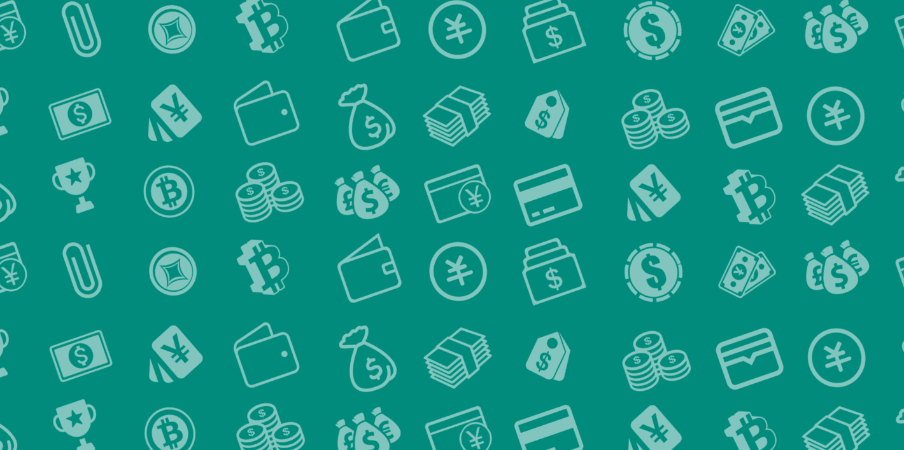
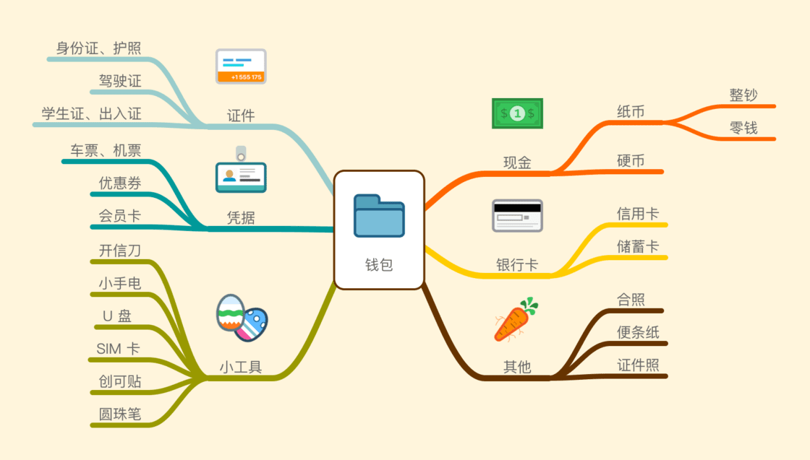
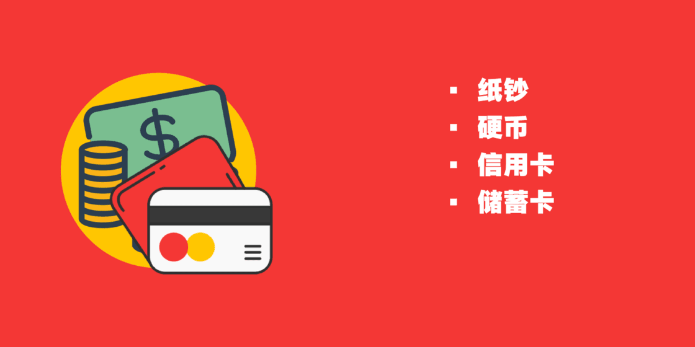
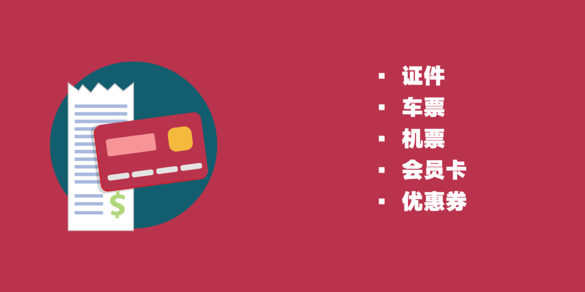
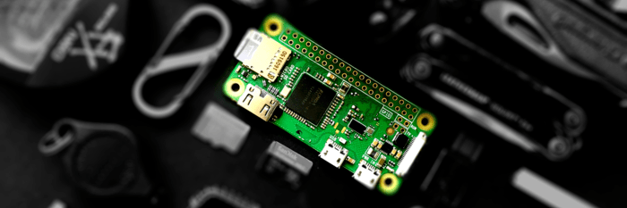
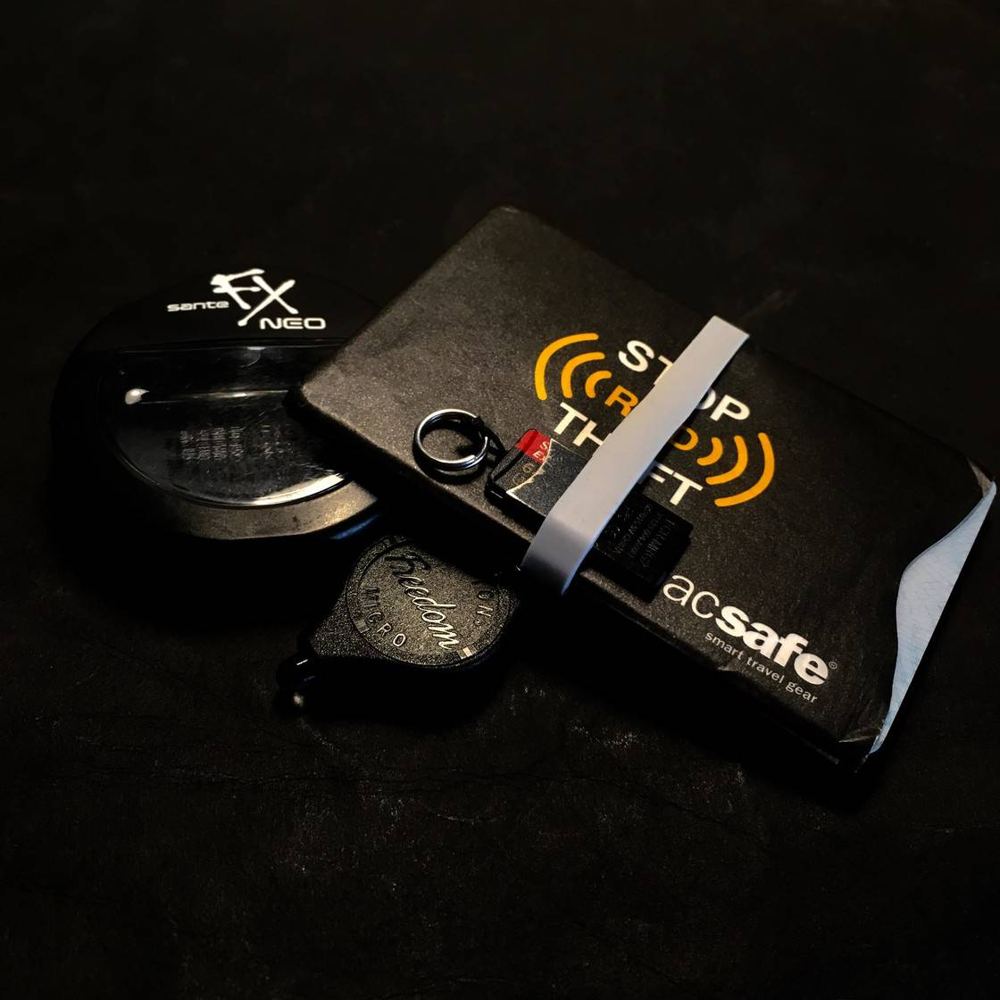
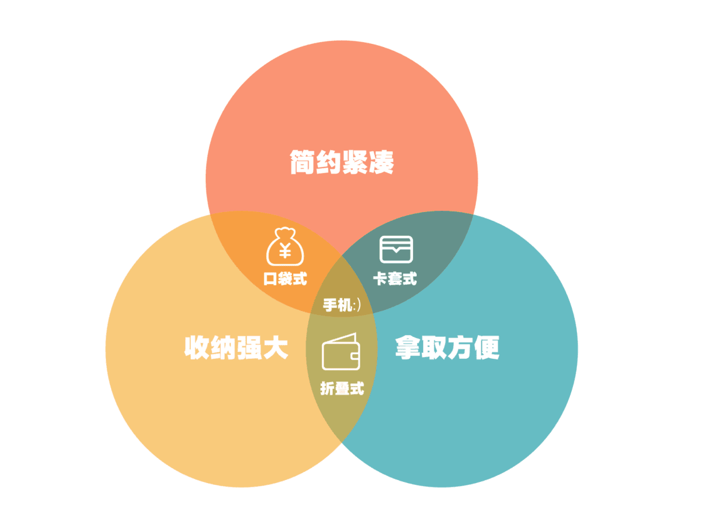

打开你的钱包看看，你有多久没有整理了？里面是不是充斥了过期优惠券？你能不假思索地取出里面的任何东西吗？

有的人觉得钱包的重要性大不如前，对钱包进行整理也是自作多情。其实，他们往往只是在移动支付的便利之下短暂忘记了这个物件的存在，一旦出差、旅行，又得拿出钱包，仍然要面对其体积庞大、塞满无用卡券、翻找东西麻烦等诸多不便。

我认为实体钱包仍然有重要意义，整理一番也是值得的。身份证件、备用现金、零碎小物品等等，还是需要有一个安定的容身之所。钱包本身随着内容物的改变，也在不断进化，但是万变不离其宗，它们总是离不了三大功能：

- 收纳
- 保护
- 取物

整理钱包也从这三个方面入手。值得高兴的是，一般我们只需要理出确有必要的物品，并调整好其存放位置，就可以达到清清爽爽的效果，不必特地购买新钱包。

## 第一步：明确所需物品

不少人购买或获赠一只钱包之后，便开始想着往里面充填哪些东西。这个习惯容易造成无用物品的堆积。就像我初次独自旅行，恨不得把整个房间里的东西都带上。这样搬家式收纳的人，每逢他们埋单，只要收银员问一句「有零钱吗」，这些家伙就得来一次地毯式搜索以翻出几枚硬币。

一个普通人的钱包，可能包含这些物件：

单看每一个，似乎都有携带的理由，但显然目前不是在准备逃荒。我们应当更理智的方式来挑选所需放入钱包的物品，同时能电子化的就借助手机，只留下必须携带实体的。

### 购买力：现金、银行卡

钱包不放钱，那还放什么呢？不巧的是，当今钱包最大的功能——存放现金，已经被大大削弱了。不过，就我自己而言，纵使生活在无现金化程度最高的杭州，却仍然遇到只能使用现金的场合，比如向传统的自动售货机买饮料，自备零钱的城乡公交，或者干脆手机没电、只能付现。

一般我以移动支付为主，备有少量现金，而旅行时则换做银行卡加现金。三者合理搭配，可以满足绝大多数情况下的支付需求。

现金我只准备两百元，一张百元大钞，五元、十元、二十元零钱若干。这个数字对于短途车投币、酒店押金来说都绰绰有余。而能用移动支付的场合，尽量收集解决，不动用现金。对了，我很少在钱包里放硬币，个中原因倒挺有趣：平日刷手机上车，我几乎用不着硬币，最多在包里放两枚以求心安；而旅至北方，大家多用纸币，唯独我投硬币引得一阵咣铛作响，露出「南蛮」戏态。

银行卡的主要作用则是取款。免卡折取款的普及度实在是可怜，我还是需要随身带着银行卡。在南亚的时候，我每到一个城市取一笔钱，不会一次性携带大量现金。

这一轮精简下来，我钱包里只放进了薄薄的几张纸币、一张银行卡。

但是，不要把鸡蛋放进一个篮子里，在背包某个不为人知的角落，请再藏一点救急现金与银行卡，平时则不要使用它们。

### 证明力：证件和票据

现在是文明社会，我们需要能证明自己是谁，其中最重要的就是身份证——即使你没有驾照、不是学生、失业赋闲，最少也免不了携带它。我在许多地方买票、办业务，都看到过没带身份证而被工作人员拒绝提供服务的可怜人。而出境时，护照的重要性同等重要。

其他的证件不是必须的，但是应当拍照保存。例如，因为我不看电影、不逛景区，就从来不带学生证（不需要蹭着点优惠）。难得在北国进了几次景点，给售票员看过证件照片就获得了半价优惠。再不济，我也用学信网的截图混了过去。更进一步，你可以使用 1Password 来加密保存证件信息。

此外还有一类临时或一次性的凭证：各种车票、机票和优惠券。行程中，车票插在钱包最外层，出站后立即存进背包的单独隔层中，千万不要乱丢，看见回收车票的不法分子绕道走。机票除了原件和照片，订单、邮件也要保存好，飞行结束后也存入背包进行「归档」。优惠券尽量在线领取，少用实体券，举例：连锁店欺客的经典手段就是「哪儿敲章，哪儿使用」，店员和经理不认识「全省范围内使用」几个大字 :p

至于会员卡，我将它们悉数扫入 Apple Wallet，这里面的操作已有 [文章](https://sspai.com/post/39833) 说明过了。不过，星巴克采用动态码，只能下载他家的应用；还有的会员卡不支持扫码或不接受电子凭证，只能老老实实带着实体卡[^1]。

### 小工具

许多人都有在钱包里放实用小物件的习惯，瑞士军刀卡、U 盘、卡片手电等轻薄的工具都受到青睐。的确，一些使用频率较高的工具，只要不占位置，都适合放在钱包里随身携带，有备无患。

但我们全然不必把汽车修理箱都装进钱包。借摄影圈一戏言：

> 买了几台单反，用得最多的，还是我的手机

以小刀为例，我用得最多的场合就是开快递，夹在钱包里的一枚陶瓷刀片完全可以应付。如果选择全尺寸的瑞士军刀，反倒会带来一些麻烦和误会。特别提醒，如果经常乘坐公共交通工具，最好还是不要携带各种刀具——除了指甲刀和美刀 :)

空中飞人们或许需要备用 SIM 卡，旅者自带圆珠笔能更快填完入境单……钱包里的小工具可以创造许多便利。远亲不如近邻，需要之时恰在手边的工具，才是我们可靠的伙伴。

可选的工具太多，读者们对于如何精简可谓一头雾水，这里引入一个概念：**[EDC](http://everydaycarry.com/)（Every Day Carry）统计，即记录每日携带的物品的使用率**。手机、钱包、钥匙，一般都属于 EDC，但最重要的还属个性化工具——下面就是我的 EDC：

新晋玩家初看到那些精致神奇的便携工具，容易产生「好有趣全都想要」的想法——正是这种不明需求就一味买买买的心态，促使我们把钱包乃至背包空间空间都挤满。其实，高级玩家会做统计来精简物品：

> 每天记录所携带物品的使用率，一段时间过后淘汰用不到的
>
> 如果从未携带某个工具也没因此造成不便，则证明你基本不需要它

借用 EDC 的统计方法，几番下来，我们就筛选出了最常用的钱包工具。经验告诉我，此时一般空间还有富余，方便成功人士往里面放全家福、倜傥君子藏匿取悦异性的卡通创可贴。

## 第二步：加个保护层

传统的 Costanza[^2] 式钱包之所以流行，就在于其厚实的材料给人一份安全感。但是当今的银行卡、二代身份证已经更换芯片，不再需要那种「户外三防」的层层保护，倒是**信息安全方面的防护问题亟待解决**。

总有人觉得黑客们离自己太遥远。其实，一台两百元的二手安卓手机，就可以让你的银行卡裸奔；在公共场所「狩猎」的罪犯也是无差别攻击，不会因为你囊中羞涩就网开一面。你需要一个 **RFID 保护层**，阻止别有用心之人扫描你的身份证、银行卡和护照。不过，过安检时请把证件取出，方便工作人员检查。

市面上带有 RFID 防护的钱包并不多，你也无需特意去购买它们，一个卡套就可以解决问题。我选择的是 Pacsafe 的 RFID 屏蔽卡套，轻量化、做工好、防泼水，银行卡套上之后也能放进钱包夹层。我自己则干脆拿它代替了之前的钱包。

我找来线缆包装盒中的橡皮筋，和两个卡套组合在一起，形成一只**带有五个夹层的迷你钱包**：

两个卡套各存放身份证和银行卡，之间的夹层放几张纸币，橡皮筋和卡套间的缝隙可以临时塞车票和小工具。整体非常紧凑干练。这个看似单薄的钱包陪我度过一万多公里车程，用到现在。

## 最后一步：调整存放位置

> 大丈夫当能屈能伸，钱包宜能吞能吐。

毕竟钱包不是黑洞，我们还是常常需要取出东西来的。不同物品取用的频率，直接决定了它们在钱包中的位置。以日常的通勤为例，使用三层存放法：

- 常用交通卡、门禁卡放最外层
- 现金、银行卡放中间层
- 身份证、驾驶证和备用证件照藏最里层
- 小工具找边边角角塞进去，不要影响取用其他物品

调整好位置后，就理出一个相对整齐的钱包了。但如果你所用钱包仍然严重影响了使用体验，可能你需要考虑买个新的。市场上的钱包无非折叠式、口袋式、卡套式等几类，各自特征明显，实在不能忍受目前所用钱包的话，我总结的一张图可供换新参考：

具体判断还请依据各人的情况。像我自制的极简钱包，卡套边缘有个缺口，取卡就很方便，但想抽出中间层的现金则要双手上阵。这是符合我常用卡、不常用现金之实际情况的。如果你经常用现金支付，或者单纯喜欢钱包开合的啪嗒声，那还是传统的两折式钱包为好。

## 尾巴

经常整理身边的物品，是非常有意思的事。我可以在一次次的精简、整理中，发现自己真正需要的东西，并且让它们秩序井然。我随身携带的这只钱包，存东西、找东西都很方便，从来没有掉过链子。

显然，整理文件、书签乃至行李、家居，都宜遵循「从需求出发」这个朴素的道理。取钱包一例，以小见大、比较好玩罢了。

---

部分免费素材来源：
- [Vectto - Iconfinder.com](https://www.iconfinder.com/vectto)
- [The Pictographers - Iconfinder.com](https://www.iconfinder.com/bluewolfski)
- [roundicons.com - Iconfinder.com](https://www.iconfinder.com/roundicons)

[^1]: 我本人素来拒绝这种卡
[^2]: 拥有大量卡位的「皮夹子」