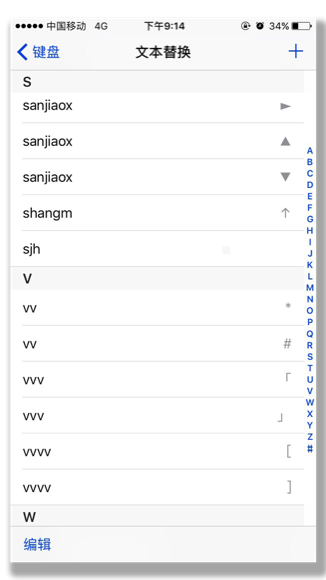
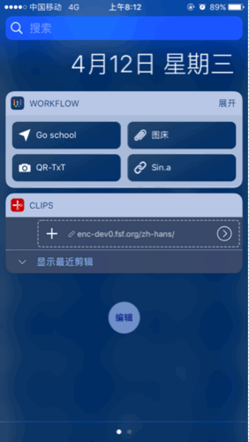

Drafts 给了我在 iOS 上写作的美好体验，摘录模版、键盘拓展以及最犀利的 URL schemes & javascript 支持让我可以把所有文本相关的处理交给它。别和我提 Word，我没生存在一个工作环境那么糟的地方:)

Drafts 不能跨操作系统使用，也不能在 Mac 上愉快地同步。一段时间里我被 Byword 的同步功能打动，每写一篇文章就导入 Byword。毫无便捷性可言。Drafts 不是一个纯粹的软件。直到我可以在手机上盲打出 Markdown 语法，于是我删除了 Drafts。它带给我的是 99% 的便捷和 1% 的强大，快速插入语法的特性是前者。现在，这是我的输入法设置：

插入最基本的语法符号比使用键盘拓展更方便。选择一个符号后，可以做重复动作进行盲操作，直到用到下一个符号。这个操作便捷性是高于在键盘和键盘拓展间切换的，如同你不会喜欢打完字之后傻傻地选词一样。

写文章，除了文字输入，所考虑的主要是考究克制的排版格式与美观到位配图。此外，处理超链接与摘录素材、发布文章也应该纳入写作流。为什么我放弃了 Drafts？因为我回到 macOS+iOS 的工作状态后（此前是 iPad & iPhone），Drafts 带来的割裂感不能忍受。Markdown 只是一种输入方式而不是展现方式，我不需要受到它的限制。考虑了其他软件后，我想，既然我要把文章粘贴到博客后台，为什么不干脆用纯文本呢？然后我就用 iPhone 自带的备忘录写作了:)

由于插图与插链接是靠 workflow 的，改用备忘录以后没有任何不便。只要乐意，在 VisualStudio 里你也可以输入一串 Markdown 格式的图片链接。下拉通知栏，然后等两秒：

还有一个比较重要的，从美学上来说，备忘录一贯的黄色字体很好看。我不能忍紫色光标在刺眼的白色背景上跳动。新的备忘录延续了 iOS6 时代便签软件与 Pages 的设计，你可以看到美式拍纸与打字机的一丝影子。

写到这里，我发现了备忘录的一个缺陷，即写了几百字之后它就会严重卡顿。显然这是不可理喻的。或许明天我就会用微信输入框写作呢。

何处不随意，以上。

****

* workflow 软件现在免费，我不会提供我的 workflow :p
* ~~图床工具请酌情选择，我购买了 ¥6 的 Picshare →[Picshare in App Store](https://itunes.apple.com/cn/app/picshare-%E5%9B%BE%E5%BA%8A%E8%BD%AF%E4%BB%B6/id1201821685?mt=8)~~
* 不想花钱的请参考七牛云图床的 workflow，但是你必须使用 Drafts，不然跑不了 javascript →[Workflow + Drafts + 七牛云，用更酷的姿势写作](https://sspai.com/post/36990)
* 我目前在用 sm.ms 图床（别想白要我的 workflow），接下来会根据稳定性和速度再进行选择