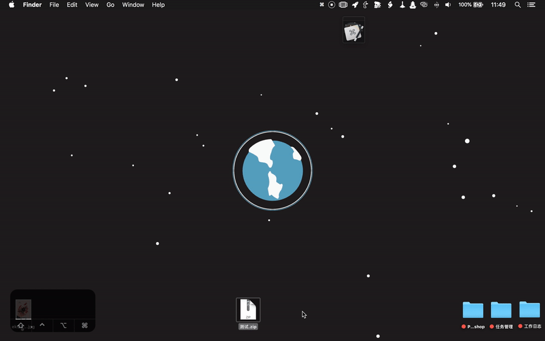

最近运营商的深夜节目（劫持）非常限制级，我从 Microsoft 的官网都能下载到东京出产的影片。

遂做了一个 LaunchBar 动作，用来校对文件的 MD5 值。



动作思路很简单：

1. 校对文件 MD5 值；
2. 与剪贴板内的值对比，并发个通知告诉我是否匹配。


```
on open (thePaths)
	set filePath to POSIX path of thePaths as string
	do shell script "md5 -q " & filePath
	set md5 to result as string
	if (the clipboard) is md5 then
		display notification md5 with title "校验合格 🎉" sound name "Frog"
	else
		display notification md5 with title "检验失败 😒" sound name "Frog"
	end if
end open
```

代码里的注意点有两个，一是要用 `on open(path)` 的 handler，不然后面不能直接跑 shell 命令；二是需要把 Alias 转成 POSIX Path。

另外，使用这个动作的话，你需要在调用这个动作前复制一下所下载资源官网上提供的 MD5 值。

当然也可以做个 Hazel 版，对每个文件都自动校对，等环境更恶劣了我再行此下策吧。
