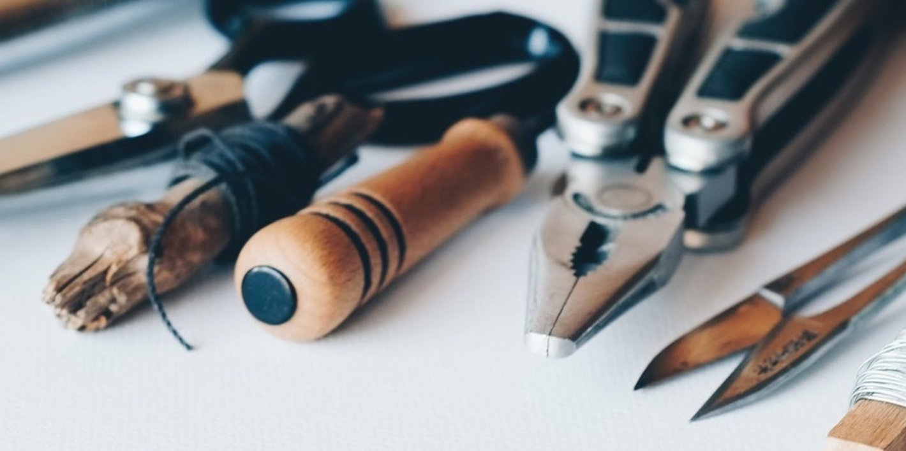
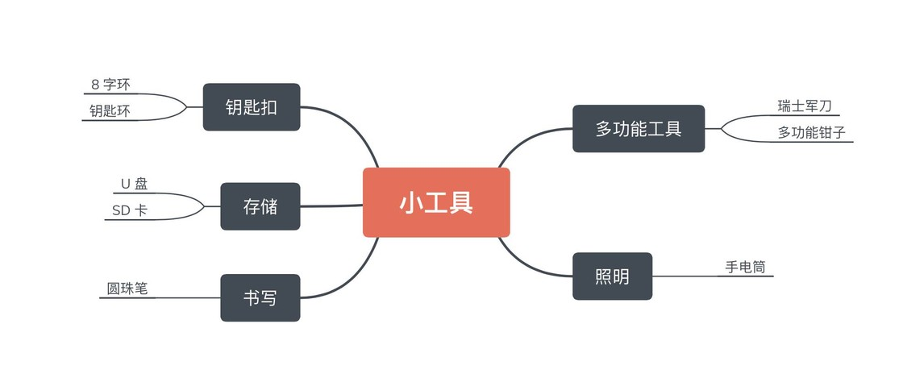
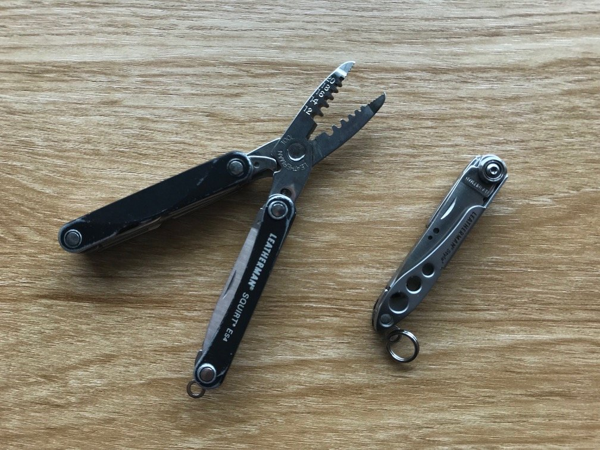
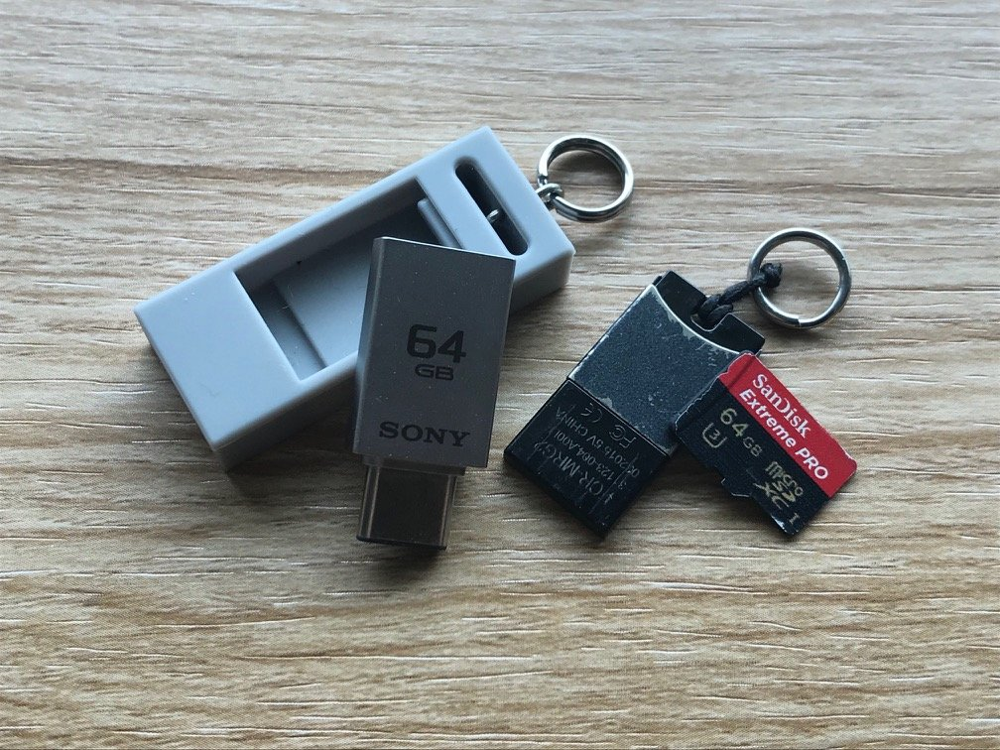
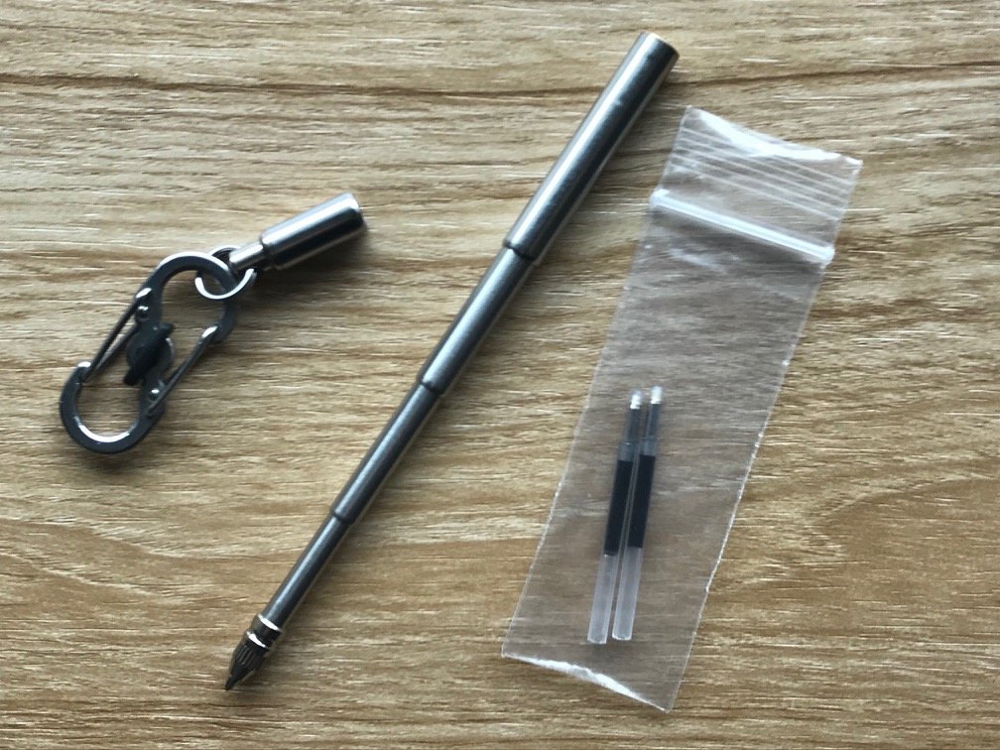
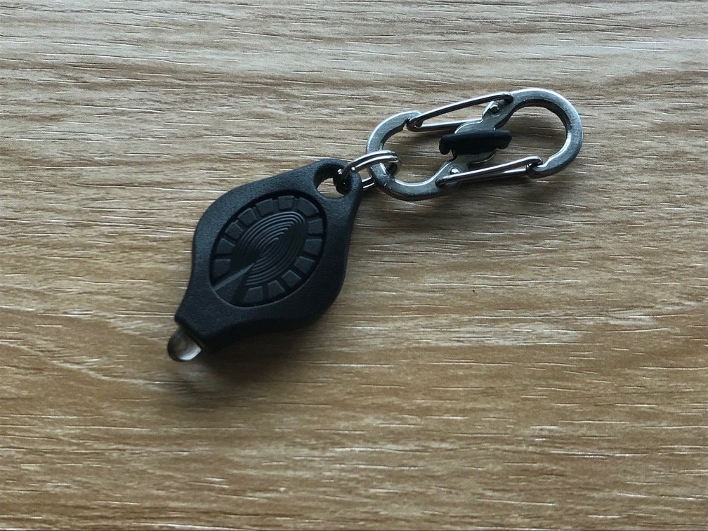
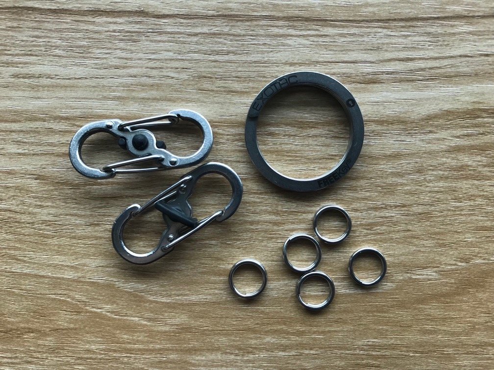
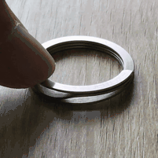

每个男孩，也许都有过自己的工具箱，里面是美工刀、修正带以及从父亲那里软磨硬泡来的打火机。

长大以后，手机成了我身上最万能的工具，我不再背着这么一箱工具出门。但是，仍然有很多许多电子设备不能解决的问题，我们需要靠一些小工具，它们被划为「EDC（Every Day Carry）」的范畴，意为「每天携带的工具」。我习惯把这些工具放在钥匙串上，贴身，轻便。

这篇文章里，我会分享一些自己在用的钥匙串工具，它们覆盖移动存储、照明、书写等多个方面。你倒不用把它们全部挂在钥匙串上，挑几个自己用得到的，就能享受到它们带来的便利。

本文只提供官网或旗舰店链接，你可以通过关键词在自己喜欢的购物网站上搜索。

## 多功能工具类

在 EDC 物品中，我觉得最不能缺少的就是多功能工具，不到一指长的小工具往往具有剪刀、指甲剪、螺丝起子、镊子等一系列功能，日常可以拆个快递、剪个包装，或者去掉手指上的倒刺。

我使用的是 [Leatherman](https://www.leatherman.com/Home) 的多功能钳子和小刀，它们比瑞士军刀更加贴合手指，不容易打滑伤到自己。

不过，请注意你所在地区的行政规范，许多多功能工具虽然不属于管制物品，但不少安检口都会对它们严加检查。

购买链接：

- [Leatherman 小钳子](https://www.leatherman.com/squirt-es4-21.html?dwvar_21_color=11&cgid=Everydaycarry#start=1)
- [Leatherman 工具刀](https://www.leatherman.com/style-23.html#q=style&lang=default&start=1)

## 备用存储类

每次别人看到我随身带个 U 盘，总会揶揄我为「修电脑小哥」。其实 U 盘是一个非常可靠的文件传输备用方案，网络状况不佳时，U 盘的重要性就显示出来了。年前 Hum 想 AirDrop 几张配图给我，两人来回半天搜不到对方，最后我掏出个 U 盘解决了问题。

现在 Type-C 接口开始流行，有些型号的 U 盘已经支持了这一最新标准，但是多数产品都不成熟，速度远远不及传统 USB 接口阵营中的高端型号。目前，为了搭配自己的 MacBook 而选用了 SONY 的 Type-C U 盘，只能忍受它每秒 10m 出头的写入速度，不建议追求速度的读者选购。

如果你想要极致的小巧，可以考虑金士顿读卡器加 SD 卡的组合，我以前用的就是这一套搭配，速度比现在的 SONY U 盘还快一些。你可以通过关键词「金士顿 + 迷你读卡器」来找到读卡器的购买链接。

关于 U 盘和 SD 卡的选购，这两篇文章会给你不少有益的建议：

[Type-C 接口 U 盘不一定是最快的，选 U 盘你最需要了解这 4 点](https://sspai.com/post/43045)
[CF、SD、Micro SD 这些卡该怎么选？这篇文章教你如何买到满意的储存卡](https://sspai.com/post/40938)

## 书写类

前几年在机场，一伙老美和中国大妈挤在柜台前借笔填入境单。我笑笑，往随身的钥匙串上一拽，一支折叠式圆珠笔就出现在手中。

填完，入境。身后的两拨人还在你侬我侬。

除了帮你从填入境单的人群中脱颖而出，一支笔也能帮你随时记录灵感——无论是写在草稿纸、广告单或者餐巾纸上，虽然我也可以选择打字，但是用纸笔来做速记的感觉更棒。如果你不是学生或文字工作者，很可能没有随身带笔的习惯，那么一支不占地方的可折叠圆珠笔就能在关键时刻帮上你。

这支 [TrueUtility](https://www.trueutility.com/) 的圆珠笔自我中学起就陪着我，非常可靠。轻轻一抽，它就展开成一支十多厘米长的笔，书写体验还行；替芯就是普通的圆珠笔芯，到处都能买到。

购买链接：[TrueUtility 圆珠笔](https://www.trueutility.com/product/telepen-2/)。

## 照明类

现在手机的功能越来越丰富，自带的手电筒功能也很方便，不过我还是随手带了一支手电筒，它们往往可以连续用上十几个小时，不用担心电量不足，而且亮度调节的范围比手机更宽，从寻找掉进床底的铅笔到远足时照亮前路都可以满足。有时我半夜摸下床找杯子喝水，就开个最低亮度，避免亮醒室友；而在乡下，手电也陪我度过不少停电的夜晚。

我选用了 Freedom Photon 手电，它采用纽扣电池供电，只比一元硬笔重一点点；更重要的是，它可以调节亮度，最远能够照射二三十米，这在城市里面使用已经绰绰有余。

购买链接：[Freedom Photon](https://www.photonlight.com/led-flashlights/photon-freedom-micro-led-keychain-flashlight/)。

## 钥匙扣

选好了工具，我们会发现，有时这些小工具很难从钥匙串上取下来。下面会介绍两种有特殊功能的钥匙扣，它们可以让工具的取放更加自如。

我用得最多的就是 Niteize 的 8 字钥匙扣，平时携带时可以转动它中间的塑料片把扣环「锁」起来，放置工具遗落；而使用时只需一转、一按，工具就可以被取下来。

另一款常备的钥匙扣就是 EXOTAC 的 FREEkey，这个其貌不扬的钥匙扣采用杠杆设计，轻轻一按就能打开一个口子，便于我们把钥匙环塞进去，不用再拿指甲去撑开钥匙扣了：

购买链接：

- [Niteize 小号带锁 8 字扣](https://www.niteize.com/product/S-Biner-MicroLock.asp)
- [Niteize 大号带锁 8 字扣](https://www.niteize.com/product/S-Biner-SlideLock.asp)
- [EXOTAC FREEkey](http://www.exotac.com/freekey-system/)

## 小结

这就是我正在使用的一些工具，它们组成了我随身的工具箱，帮我解决了开快递、走夜路、拷贝数据等生活中的细碎问题。当我们有需要时，如果这些小工具恰好就在身边，将会倍感安心。